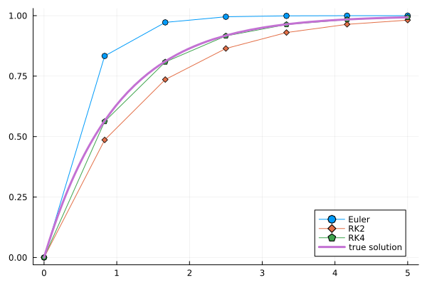
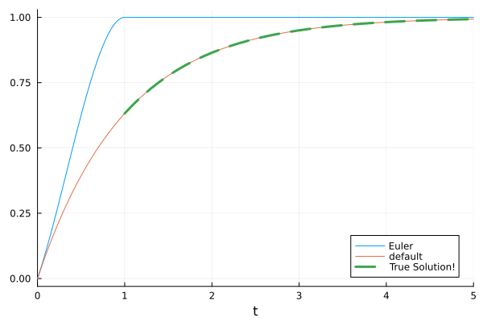
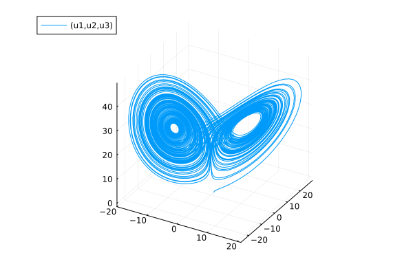
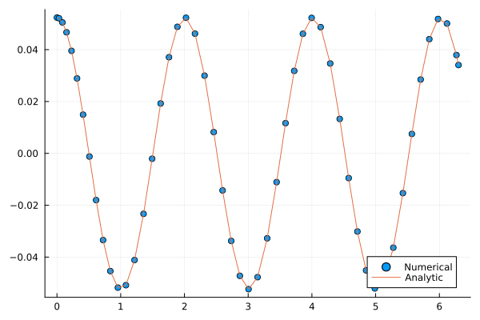

# Who am I ?


  * My name is *Pierre Navaro*
  * **Fortran 77 + PVM** : during my PhD 1998-2002 (Université du Havre)
  * **Fortran 90-2003 + OpenMP-MPI** : Engineer in Strasbourg (2003-2015) at IRMA
  * **Numpy + Cython, R + Rcpp** : Engineer in Rennes (2015-now) at IRMAR
  * **Julia v1.0** since July 2018


## Instructions to open the notebook and slides


  * https://github.com/pnavaro/JuliaSMAI2021
  * https://pnavaro.github.io/JuliaSMAI2021


---


# Why Julia?


  * Started in 2009 and first version was released in 2012.
  * High-level languages like Python and R let one explore and experiment rapidly, but can run slow.
  * Low-level languages like Fortran/C++ tend to take longer to develop, but run fast.
  * This is sometimes called the "two language problem" and is something the Julia developers set out to eliminate.
  * Julia's promise is to provide a "best of both worlds" experience for programmers who need to develop novel algorithms and bring them into production environments with minimal effort.


**Julia: A Fresh Approach to Numerical Computing**


*Jeff Bezanson, Alan Edelman, Stefan Karpinski, Viral B. Shah*


SIAM Rev., 59(1), 65–98. (34 pages) 2012


**SciML Scientific Machine Learning Software** https://sciml.ai/citing/


**Differentialequations.jl–a performant and feature-rich ecosystem for solving differential equations in julia,**


*Christopher Rackauckas and Qing Nie*,


Journal of Open Research Software,, volume 5, number 1, 2017.


---


# Implement your own numerical methods to solve


$$ y'(t) = 1 - y(t),  t \in [0,5],  y(0) = 0. $$


--


## Explicit Euler


```julia
euler(f, t, y, h) = t + h, y + h * f(t, y)
```


```
euler (generic function with 1 method)
```


## Runge-Kutta 2nd order


```julia
rk2(f, t, y, h) = begin
    ỹ = y + h / 2 * f(t, y)
    t + h, y + h * f(t + h / 2, ỹ)
end
```


```
rk2 (generic function with 1 method)
```


---


## Runge-Kutta 4th order


```julia
function rk4(f, t, y, dt)

    y₁ = dt * f(t, y)
    y₂ = dt * f(t + dt / 2, y + y₁ / 2)
    y₃ = dt * f(t + dt / 2, y + y₂ / 2)
    y₄ = dt * f(t + dt, y + y₃)

    t + dt, y + (y₁ + 2 * y₂ + 2 * y₃ + y₄) / 6

end
```


```
rk4 (generic function with 1 method)
```


---


## Solve function


```julia
function dsolve(f, method, t₀, y₀, h, nsteps)

    t = zeros(Float64, nsteps)
    y = similar(t)

    t[1] = t₀
    y[1] = y₀

    for i = 2:nsteps
        t[i], y[i] = method(f, t[i-1], y[i-1], h)
    end

    t, y

end
```


```
dsolve (generic function with 1 method)
```


---


## Plot solutions


```julia
using Plots

nsteps, tfinal = 7, 5.0
t₀, x₀ = 0.0, 0.0
dt = tfinal / (nsteps - 1)
f(t, x) = 1 - x

t, y_euler = dsolve(f, euler, t₀, x₀, dt, nsteps)

t, y_rk2 = dsolve(f, rk2, t₀, x₀, dt, nsteps)

t, y_rk4 = dsolve(f, rk4, t₀, x₀, dt, nsteps)
```


```
([0.0, 0.8333333333333334, 1.6666666666666667, 2.5, 3.3333333333333335, 4.166666666666667, 5.0], [0.0, 0.5624678497942387, 0.8085656175363232, 0.9162413030173554, 0.9633528772107507, 0.9839657055671652, 0.9929844806797695])
```


---


```julia
plot(t, y_euler; marker = :o, label = "Euler")
plot!(t, y_rk2; marker = :d, label = "RK2")
plot!(t, y_rk4; marker = :p, label = "RK4")
plot!(t -> 1 - exp(-t); line = 3, label = "true solution")
```





---


## DifferentialEquations.jl


```julia
using DifferentialEquations

f(y, p, t) = 1.0 - y
y₀, t = 0.0, (0.0, 5.0)

prob = ODEProblem(f, y₀, t)

sol_euler = solve(prob, Euler(), dt = 1.0)
sol = solve(prob)
```


```
retcode: Success
Interpolation: automatic order switching interpolation
t: 15-element Vector{Float64}:
 0.0
 9.999999999999999e-5
 0.0010999999999999998
 0.011099999999999997
 0.07674209860034185
 0.2256220209761885
 0.4455760494689467
 0.7272505875899613
 1.08996450301086
 1.5331654123549805
 2.0697241857623103
 2.705750702626476
 3.4562447902280993
 4.337840756338852
 5.0
u: 15-element Vector{Float64}:
 0.0
 9.999500016666247e-5
 0.001099395221772342
 0.011038622307372232
 0.07387132730531631
 0.20198031990033405
 0.35954475580746365
 0.5167641828239731
 0.6637714219615871
 0.7841482550875905
 0.873778428109482
 0.9331779992336123
 0.968448972257105
 0.9869310694285475
 0.9932596937930706
```


---


```julia
plot(sol_euler, label = "Euler")
plot!(sol, label = "default")
plot!(1:0.1:5, t -> 1.0 - exp(-t), lw = 3, ls = :dash, label = "True Solution!")
```





---


`sol.t` is the array of time points that the solution was saved at


```julia
sol.t
```


```
15-element Vector{Float64}:
 0.0
 9.999999999999999e-5
 0.0010999999999999998
 0.011099999999999997
 0.07674209860034185
 0.2256220209761885
 0.4455760494689467
 0.7272505875899613
 1.08996450301086
 1.5331654123549805
 2.0697241857623103
 2.705750702626476
 3.4562447902280993
 4.337840756338852
 5.0
```


`sol.u` is the array of solution values


```julia
sol.u
```


```
15-element Vector{Float64}:
 0.0
 9.999500016666247e-5
 0.001099395221772342
 0.011038622307372232
 0.07387132730531631
 0.20198031990033405
 0.35954475580746365
 0.5167641828239731
 0.6637714219615871
 0.7841482550875905
 0.873778428109482
 0.9331779992336123
 0.968448972257105
 0.9869310694285475
 0.9932596937930706
```


---


```julia
function lorenz(du, u, p, t)
    du[1] = 10.0 * (u[2] - u[1])
    du[2] = u[1] * (28.0 - u[3]) - u[2]
    du[3] = u[1] * u[2] - (8 / 3) * u[3]
end

u0 = [1.0; 0.0; 0.0]
tspan = (0.0, 100.0)
prob = ODEProblem(lorenz, u0, tspan)

sol = solve(prob)
```


```
retcode: Success
Interpolation: automatic order switching interpolation
t: 1300-element Vector{Float64}:
   0.0
   3.5678604836301404e-5
   0.0003924646531993154
   0.003262408518896374
   0.009058077168386882
   0.01695647153663815
   0.027689960628879868
   0.041856351821061455
   0.06024041060823337
   0.08368540639551347
   ⋮
  99.25227436435598
  99.34990050231407
  99.47329750836677
  99.56888278883171
  99.68067056500875
  99.7698930548574
  99.86396908592394
  99.9520070464327
 100.0
u: 1300-element Vector{Vector{Float64}}:
 [1.0, 0.0, 0.0]
 [0.9996434557625105, 0.0009988049817849058, 1.781434788799189e-8]
 [0.9961045497425811, 0.010965399721242457, 2.1469553658389193e-6]
 [0.9693591566959717, 0.089770627357676, 0.0001438019004555601]
 [0.9242043510496474, 0.24228916412927515, 0.0010461626692665619]
 [0.8800455755115648, 0.43873651254178225, 0.003424260317913913]
 [0.8483309815012585, 0.6915629798778471, 0.008487625758932924]
 [0.8495036692770451, 1.0145426674126548, 0.018212090760571238]
 [0.9139069519040545, 1.4425599553295452, 0.036693820689070726]
 [1.088863767524423, 2.052326420986981, 0.07402572431671739]
 ⋮
 [5.791198832787258, 3.8198742723079415, 26.666685868569655]
 [4.959577668148714, 5.1627464679185815, 22.495413403699086]
 [6.653100232410356, 9.122429705812463, 20.41123180056622]
 [9.593094878342031, 12.952212134722183, 23.567760855989487]
 [11.932162424256417, 11.761476358727544, 31.642393421283604]
 [9.907977700774161, 6.112102601076882, 32.83064925680822]
 [6.4119417247899015, 3.408711533396652, 28.483033292250997]
 [4.734282403550539, 3.913681157796059, 24.002168300285124]
 [4.596259899368738, 4.819051128437629, 22.02318896633189]
```


---


```julia
plot(sol, vars = (1, 2, 3))
```





---


```julia
using ParameterizedFunctions

lotka_volterra = @ode_def begin
  d🐁 = α*🐁  - β*🐁*🐈
  d🐈 = -γ*🐈 + δ*🐁*🐈
end α β γ δ

u0 = [1.0, 1.0] # Initial condition

tspan = (0.0, 10.0) # Simulation interval
tsteps = 0.0:0.1:10.0 # intermediary points

p = [1.5, 1.0, 3.0, 1.0] # equation parameters: p = [α, β, δ, γ]

prob = ODEProblem(lotka_volterra, u0, tspan, p)
sol = solve(prob)
```


```
retcode: Success
Interpolation: automatic order switching interpolation
t: 34-element Vector{Float64}:
  0.0
  0.0776084743154256
  0.23264513699277584
  0.4291185174543143
  0.6790821776882875
  0.9444045910389707
  1.2674601253261835
  1.6192913723304114
  1.9869755337814992
  2.264090367186479
  ⋮
  7.584862904164952
  7.978068388305894
  8.483164907244102
  8.719247868929038
  8.949206527971544
  9.200184813643565
  9.438028630962807
  9.711807852444823
 10.0
u: 34-element Vector{Vector{Float64}}:
 [1.0, 1.0]
 [1.0454942346944578, 0.8576684823217128]
 [1.1758715885138271, 0.6394595703175443]
 [1.419680960717083, 0.4569962601282089]
 [1.876719348554606, 0.3247334369618526]
 [2.5882499852859393, 0.2633625580453103]
 [3.8607087712687553, 0.2794458027885771]
 [5.750812903389161, 0.5220073140479407]
 [6.814978737433832, 1.9177833002392186]
 [4.392997780791407, 4.1946715369880305]
 ⋮
 [2.614252575185944, 0.26416950055716376]
 [4.241073168581897, 0.3051234585755414]
 [6.79112247059057, 1.1345265418480144]
 [6.265373525944333, 2.7416901960175952]
 [3.7807679106507135, 4.431164786168472]
 [1.8164212283792986, 4.0640577258289206]
 [1.1465027088171262, 2.7911726063898796]
 [0.9557986534742244, 1.6235632025270699]
 [1.0337581393337103, 0.9063703701433367]
```


---


# Type-Dispatch Programming


  * Centered around implementing the generic template of the algorithm not around building representations of data.
  * The data type choose how to efficiently implement the algorithm.
  * With this feature share and reuse code is very easy


[JuliaCon 2019 | The Unreasonable Effectiveness of Multiple Dispatch | Stefan Karpinski](https://youtu.be/kc9HwsxE1OY)


---


Simple gravity pendulum


```julia
using DifferentialEquations, Plots

g = 9.79 # Gravitational constants
L = 1.00 # Length of the pendulum

#Initial Conditions
u₀ = [0, π / 60] # Initial speed and initial angle
tspan = (0.0, 6.3) # time domain

#Define the problem
function simplependulum(du, u, p, t)
    θ = u[1]
    dθ = u[2]
    du[1] = dθ
    du[2] = -(g/L)*θ
end

prob = ODEProblem(simplependulum, u₀, tspan)
sol = solve(prob, Tsit5(), reltol = 1e-6)
```


```
retcode: Success
Interpolation: specialized 4th order "free" interpolation
t: 51-element Vector{Float64}:
 0.0
 0.031087055826046293
 0.08561410455758335
 0.15017614691650324
 0.22844999436654792
 0.31505858231866835
 0.4095255075418717
 0.5094804430063147
 0.6142606578277134
 0.72338143341672
 ⋮
 5.276991325356822
 5.427395817422836
 5.568207787381734
 5.706096558149855
 5.841862325393668
 5.978574228631899
 6.118893740946424
 6.267408663728185
 6.3
u: 51-element Vector{Vector{Float64}}:
 [0.0, 0.05235987755982988]
 [0.0016251489879623073, 0.05211238162371752]
 [0.004429323578461451, 0.05049245161124966]
 [0.007577026053634464, 0.04668511432388565]
 [0.010968721741242842, 0.03954356908050488]
 [0.013951484314397538, 0.028913538959919053]
 [0.016038240976564314, 0.01494396575185742]
 [0.016729739945624947, -0.0012207095821331396]
 [0.015713051631513333, -0.018011256622470582]
 [0.01287861562192371, -0.033433501659675874]
 ⋮
 [-0.012041959468782823, -0.03635811032208747]
 [-0.016001761820266174, -0.015321754762310562]
 [-0.016561980301197276, 0.007493917734965578]
 [-0.014042743015967987, 0.028477587841558318]
 [-0.009043602360010575, 0.04405513709011236]
 [-0.0023878872381123874, 0.05182397522359901]
 [0.004879129107119757, 0.05008479822197787]
 [0.011535281553239119, 0.03793234267587234]
 [0.012709480659105314, 0.0340611091556325]
```


---


Analytic and computed solution


```julia
u = u₀[2] .* cos.(sqrt(g / L) .* sol.t)

scatter(sol.t, getindex.(sol.u, 2), label = "Numerical")
plot!(sol.t, u, label = "Analytic")
```





---


[Numbers with Uncertainties](http://tutorials.juliadiffeq.org/html/type_handling/02-uncertainties.html)


```julia
using Measurements

g = 9.79 ± 0.02; # Gravitational constants
L = 1.00 ± 0.01; # Length of the pendulum

#Initial Conditions
u₀ = [0 ± 0, π / 60 ± 0.01] # Initial speed and initial angle

#Define the problem
function simplependulum(du, u, p, t)
    θ = u[1]
    dθ = u[2]
    du[1] = dθ
    du[2] = -(g/L)*θ
end

#Pass to solvers
prob = ODEProblem(simplependulum, u₀, tspan)
sol = solve(prob, Tsit5(), reltol = 1e-6);
```


---


Analytic solution


```julia
u = u₀[2] .* cos.(sqrt(g / L) .* sol.t)

plot(sol.t, getindex.(sol.u, 2), label = "Numerical")
plot!(sol.t, u, label = "Analytic")
```


---


# Poisson Equation


$$ \frac{\partial^2 u}{\partial x^2} = b  \qquad x \in [0,1] $$


$$ u(0) = u(1) = 0, \qquad b = \sin(2\pi x) $$


```julia
using Plots, SparseArrays


Δx = 0.05
x = Δx:Δx:1-Δx ## Solve only interior points: the endpoints are set to zero.
n = length(x)
B = sin.(2π*x) * Δx^2

P = spdiagm( -1 =>    ones(Float64,n-1),
              0 => -2*ones(Float64,n),
              1 =>    ones(Float64,n-1))

u1 = P \ B
```


```
19-element Vector{Float64}:
 -0.007892189393343805
 -0.015011836300750241
 -0.020662020077425496
 -0.02428966136816338
 -0.02553966136816338
 -0.02428966136816338
 -0.020662020077425496
 -0.015011836300750243
 -0.007892189393343808
 -3.469446951953614e-18
  0.007892189393343803
  0.015011836300750241
  0.020662020077425496
  0.024289661368163386
  0.025539661368163387
  0.02428966136816339
  0.0206620200774255
  0.015011836300750245
  0.007892189393343806
```


---


```julia
plot([0;x;1],[0;u1;0], label="computed")
scatter!([0;x;1],-sin.(2π*[0;x;1])/(4π^2),label="exact")
```


---


# DiffEqOperators.jl


```julia
using DiffEqOperators

Δx = 0.05
x = Δx:Δx:1-Δx ## Solve only interior points: the endpoints are set to zero.
n = length(x)
b = sin.(2π*x)

# Second order approximation to the second derivative
order = 2
deriv = 2

Δ = CenteredDifference{Float64}(deriv, order, Δx, n)
bc = Dirichlet0BC(Float64)

u2 = (Δ * bc) \ b
```


```
19-element Vector{Float64}:
 -0.007892189393343811
 -0.015011836300750255
 -0.020662020077425514
 -0.024289661368163407
 -0.025539661368163415
 -0.02428966136816342
 -0.020662020077425538
 -0.015011836300750286
 -0.007892189393343851
 -4.597017211338539e-17
  0.00789218939334376
  0.015011836300750198
  0.020662020077425455
  0.024289661368163344
  0.02553966136816335
  0.024289661368163355
  0.02066202007742548
  0.015011836300750233
  0.007892189393343801
```


---


```julia
plot([0;x;1],[0;u2;0], label="computed")
scatter!([0;x;1],-sin.(2π*[0;x;1])/(4π^2),label="exact")
```


---


# HOODESolver.jl


The objective of this Julia package is to valorize the recent developments carried out within [INRIA team MINGuS](https://team.inria.fr/mingus/) on Uniformly Accurate numerical methods (UA) for highly oscillating problems. We propose to solve the following equation


$$
\frac{d u(t)}{dt} = \frac{1}{\varepsilon} A u(t) + f(t, u(t)), \qquad u(t=t_0)=u_0, \qquad \varepsilon\in ]0, 1], \qquad (1)
$$


with


  * $u : t \in [t_0, t_1] \mapsto u(t)\in \mathbb{R}^n, \quad t_0, t_1 \in \mathbb{R}$,
  * $u_0 \in \mathbb{R}^n$,
  * $A\in {\mathcal{M}}_{n,n}(\mathbb{R})$ is such that $\tau \mapsto \exp(\tau A)$ is $2 \pi$-periodic,
  * $f : (t, u) \in  \mathbb{R}\times \mathbb{R}^n \mapsto \mathbb{R}^n$.


https://ymocquar.github.io/HOODESolver.jl/stable/


Philippe Chartier, Nicolas Crouseilles, Mohammed Lemou, Florian Mehats and Xiaofei Zhao.


Package: Yves Mocquard and Pierre Navaro.


---


## Two-scale formulation


First, rewrite equation (1) using the variable change $w(t)=\exp(-(t-t_0)A/\varepsilon) u(t)$ to obtain


$$
\frac{d w(t)}{dt} = F\Big(\frac{t-t_0}{\varepsilon}, w(t) \Big), $$

$$w(t_0) = u_0, \varepsilon \in ]0, 1], $$


where the function $F$ is expressed from the data of the original problem (1)

$$F\Big( \frac{s}{\varepsilon}, w \Big) = \exp(-sA/\varepsilon) \; f( \exp(sA/\varepsilon), \; w).
$$


We then introduce the function $U(t, \tau), \tau\in [0, 2 \pi]$ such that $U(t, \tau=(t-t_0)/\varepsilon) = w(t)$. The two-scale function is then the solution of the following equation.


$$
\frac{\partial U}{\partial t} + \frac{1}{\varepsilon} \frac{\partial U}{\partial \tau} =  F( \tau, U), \;\;\; U(t=t_0, \tau)=\Phi(\tau), \;\; \varepsilon\in ]0, 1], \;\;\;\;\;\;\;\;\;\; (2)
$$


where $\Phi$ is a function checking $\Phi(\tau=0)=u_{0}$ chosen so that the $U$ solution of (2) is smooth.


---


# Hénon-Heiles Example


We consider the system of Hénon-Heiles satisfied by $u(t)=(u_1, u_2, u_3, u_4)(t)$.


$$
\frac{d u }{dt} = \frac{1}{\varepsilon} Au + f(u),  $$
$$ u(t_0)=u_0 \in \mathbb{R}^4,
$$


where $A$ and $f$ are selected as follows


$$
A=
\\begin{pmatrix}
0 & 0 & 1 & 0  \\\\
0 & 0 & 0 & 0  \\\\
-1 & 0 & 0 & 0  \\\\
0 & 0 & 0 & 0
\\end{pmatrix}, \qquad
f(u) = \left(
\begin{array}{cccc}
0 \\\\
u_4\\\\
-2 u_1 u_2\\\\
-u_2-u_1^2+u_2^2
\end{array}
\right).
$$


---


# SplitODEProblem


The `SplitODEProblem` type from package [DifferentialEquations.jl](https://diffeq.sciml.ai/stable/types/split_ode_types/) offers a interface for this kind of problem.


```julia
using Plots, DifferentialEquations

epsilon = 0.002
A = [ 0 0 1 0 ;
      0 0 0 0 ;
     -1 0 0 0 ;
      0 0 0 0 ]

f1 = DiffEqArrayOperator( A ./ epsilon)

function f2(du, u, p, t)
    du[1] = 0
    du[2] = u[4]
    du[3] = 2*u[1]*u[2]
    du[4] = -u[2] - u[1]^2 + u[2]^2
end

tspan = (0.0, 0.1)

u0 = [0.55, 0.12, 0.03, 0.89]

prob1 = SplitODEProblem(f1, f2, u0, tspan);
sol1 = solve(prob1, ETDRK4(), dt=0.001);
```


---


```julia
using HOODESolver, Plots

A = [ 0 0 1 0 ;
      0 0 0 0 ;
     -1 0 0 0 ;
      0 0 0 0 ]

f1 = LinearHOODEOperator( epsilon, A)

prob2 = SplitODEProblem(f1, f2, u0, tspan);

sol2 = solve(prob2, HOODEAB(), dt=0.01);
```


```
solve function prob=HOODESolver.HOODEProblem{Float64}(HOODESolver.HOODEFunction{true, 4}(Main.ex-index.f2), [0.55, 0.12, 0.03, 0.89], (0.0, 0.1), missing, [0 0 1 0; 0 0 0 0; -1 0 0 0; 0 0 0 0], 0.002, missing),
 nb_tau=32, order=4, order_prep=6, dense=true,
 nb_t=10, getprecision=true, verbose=100

 10/10

 12/12
```


---


```julia
plot(sol1, vars=[3], label="EDTRK4")
plot!(sol2, vars=[3], label="HOODEAB")
plot!(sol2.t, getindex.(sol2.u, 3), m=:o, label="points")
```


---


# High precision


```julia
u0 = BigFloat.([90, -44, 83, 13]//100)
t_end = big"1.0"
epsilon = big"0.0017"

prob = HOODEProblem(f2, u0, (big"0.0",t_end), missing, A, epsilon)
```


```
HOODEProblem with uType Vector{BigFloat} and tType BigFloat. In-place: nothing
timespan: (0.0, 1.0)
u0: 4-element Vector{BigFloat}:
  0.8999999999999999999999999999999999999999999999999999999999999999999999999999965
 -0.4400000000000000000000000000000000000000000000000000000000000000000000000000014
  0.830000000000000000000000000000000000000000000000000000000000000000000000000001
  0.1300000000000000000000000000000000000000000000000000000000000000000000000000006
```


The float are coded on 512 bits.


---


## Precision of the result with ε = 0.015


JOSS paper https://joss.theoj.org/papers/10.21105/joss.03077


Much of HOODESolver.jl was implemented by Y. Mocquard while he was supported by Inria through the AdT (Aide au développement technologique) J-Plaff of the center Rennes- Bretagne Atlantique.


---


# Why use Julia language!


  * **You develop in the same language in which you optimize.**
  * Packaging system is very efficient (5858 registered packages)
  * PyPi (311,500 projects) R (17739 packages)
  * It is very easy to create a package (easier than R and Python)
  * It is very easy to access to a GPU device.
  * Nice interface for Linear Algebra and Differential Equations
  * Easy access to BLAS, LAPACK and scientific computing librairies.
  * Julia talks to all major Languages - mostly without overhead!


---


# What's bad


  * It is still hard to build shared library or executable from Julia code.
  * Compilation times lattency. Using [Revise.jl](https://github.com/timholy/Revise.jl) helps a lot.
  * Plotting takes time (5 seconds for the first plot)
  * OpenMP is better than the Julia multithreading library but it is progressing.
  * Does not work well with vectorized code, you need to do a lot of inplace computation to avoid memory allocations and use explicit views to avoid copy. There are some packages like [LoopVectorization.jl](https://github.com/JuliaSIMD/LoopVectorization.jl).


[What's Bad About Julia by Jeff Bezanson](https://www.youtube.com/watch?v=TPuJsgyu87U)


---


## From zero to Julia!


https://techytok.com/from-zero-to-julia/


## Python-Julia benchmarks by Thierry Dumont


https://github.com/Thierry-Dumont/BenchmarksPythonJuliaAndCo/wiki


## Mailing List


  * https://listes.services.cnrs.fr/wws/info/julia


---


*This page was generated using [Literate.jl](https://github.com/fredrikekre/Literate.jl).*

